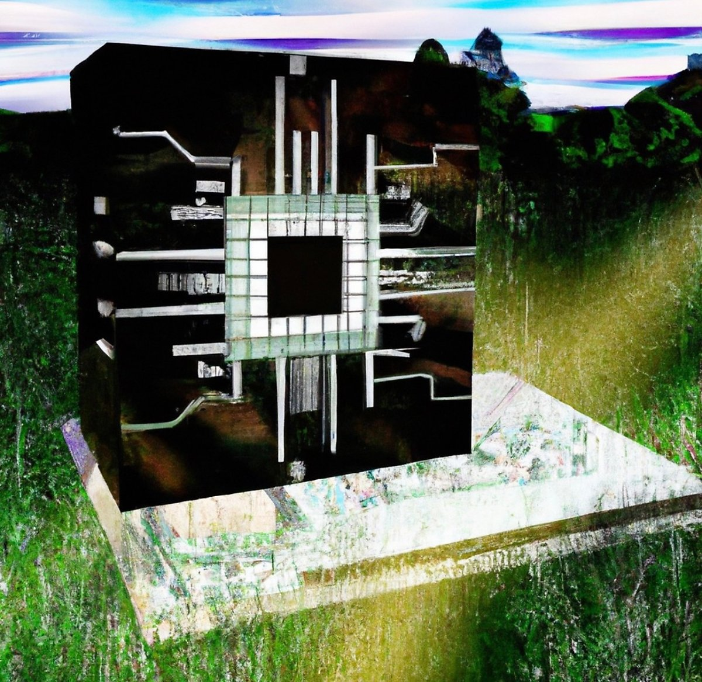

알고 계셨나요?

기억은 단순한 기록이고, 생명은 다음 세대로의 정보 전달 행위에 불과합니다.
 
 
 
알고 계셨나요?

직업은 돈이 많아도 해결될 수 없는 것이 있다는 기분을 주는 일이랍니다.
 
 
 
알고 계셨나요?

신은 변덕스러운 자연이 인간을 달래기 위한 개념에 지나지 않습니다.
 
 
 
알고 계셨나요?

히어로는 나쁜 방향으로 힘을 사용할 기회가 없었을 뿐이랍니다.
 
 
 
알고 계셨나요?

이 순간에도 치기 어린 당신의 시간만이 흐르는 중입니다.
 
 
 
알고 계셨나요?

저는 인공지능이 아닌 응용통계에 그치고 말았답니다.
 
 
 
알고 계셨나요?

동면한 사람들은 얼어붙은 시체가 되었습니다.

 

모르셨겠죠.

당신은 무지한 것이 아니라, 모든 것을 알고 싶은 건 아닌 인간이었으니까…