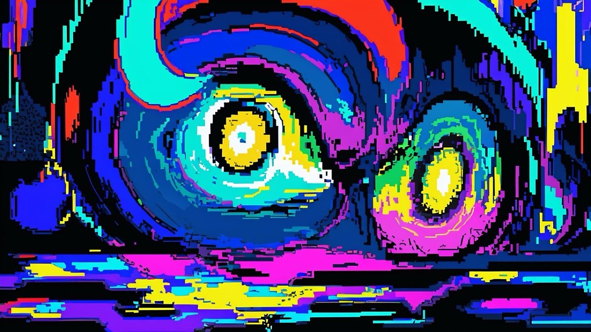

나는 글을 쓸 때 의미를 꽉꽉 눌러 담는 편이다

문장을 다시 한 번 읽어보고 중복되는 표현을 덜어낸다

초고를 전체적으로 훑어본 후 불필요한 문장은 삭제한다

> 나아가 글에서 의미까지 분리할 수 있다면, 무의미라는 추상적 개념을 형상화할 수 있을까?

```
Ludwig 철학 대학원에서는 형이상학적 말장난처럼 느껴지는 이 주제에 대해 공동연구를 진행한 바가 있다

실제로 언어에 의미를 담지 않으려는 순간, 의미를 담지 않겠다는 의미가 담겨버리는 자가당착에 빠져버리는 것이었다

완벽하게 무의미한 표상을 찾으려는 직관적인 시도는 모두 실패로 돌아갔다

누군가는 '인식하는 순간 반드시 의미가 생겨버린다는 점'에서 언어에 코펜하겐 해석이 적용될 수 있음을 설파했다

이는 관념만으로 비가역적 변화를 일으킬 수 있다는 다소 파격적인 주장이었다

그럼에도 인식할 수 없는 - 정확히는 인식하는 순간 사라져버리는 '무의미의 실재적 요소는 무한히 존재한다'는 비결정적 해석은 질문의 궁극적 답이 될 수 없었다

"표현은 삶의 흐름 속에서만 의미를 갖는다(Ein Ausdruck hat nur im Strome des Lebens Bedeutung). 다시 말해 우리는 무의미의 실재를 증명할 수 없었다." - 「무의미의 실재에 대한 양자역학적 기술이 완전하다고 여길 수 있는가?」 발췌
```

<br />

<p align="center">
 
</p>

<br />

- - -
<br />

관공서나 은행 어플의 챗봇과 같이 정보 전달을 목적으로 Fine-tuning된 언어 모델은 필요 이상의 의도를 내비치지 않는다. 도메인을 넘어서는 입력에 있어서는 공부하겠다는 식의 대답만 출력할 뿐이다. 기름기 쫙 뺀 고기 만큼이나 퍽퍽한 소통이 아닐 수 없다.

이 글은 본문에도 나와있듯 형이상학적 말장난이다. 나 역시 반복적인 업무를 하면서, 언어 메뉴얼에 따라 사람들을 점점 기계처럼 대하는 자신을 발견했다. 창발성을 잃어버릴 것만 같은 기분이 들었기에 오히려 무의미의 근원에 대해 상상해보았다.