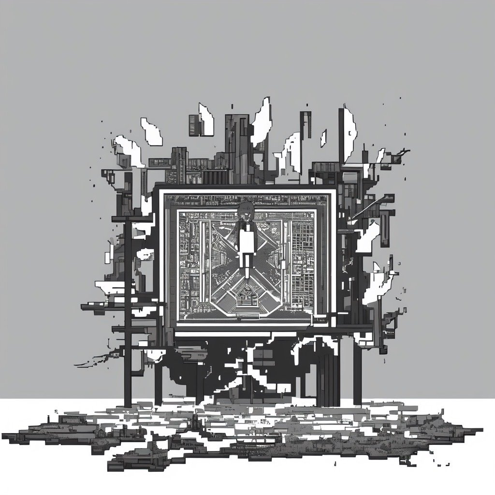

세계를 창조하는 것은 절대적인 관찰자가 되는 일이며, 인물·사건·배경은 데카르트의 악마에 의해 모든 것이 조작되는 꼭두각시 인형극이다.

자유, 그것은 운명이라 불리우는 창조주의 프로그래밍 속 부산물이다.
<br />

- - -
<br />

```
A는 뒤를 돌아보았다

누군가의 시선이 느껴졌기 때문이다

뒤에는 아무도 없었다

문제는 아무도 없음을 확인했음에도, 뒤통수를 찌르는 감각은 사라지지 않았다는 점이다

A는 오한을 느꼈고 뺨에 식은 땀이 한 방울 흘렀다

도저히 이해할 수 없는 감각에 주저앉아 눈을 질끈 감았다

A는 지금 있는 곳이 어디인지조차 설명할 수 없음을 깨닫는다

소리라도 지르고 싶었지만 마치 입이 없는 듯 열리지 않는다

그러다 문득 신의 존재를 떠올린다
```

<br />

- - -
<br />

외부의 개입이 없다면 꿈에서의 한정된 감각에 위화감을 느끼지 않는다.

관측 가능한 우주 밖의 자극에 일순간 모든 것이 무너질 수 있으니, 내 감각이 몰입하는 모든것이 주는 가치가 나에게는 전부이다.

<p align="center">
 
</p>