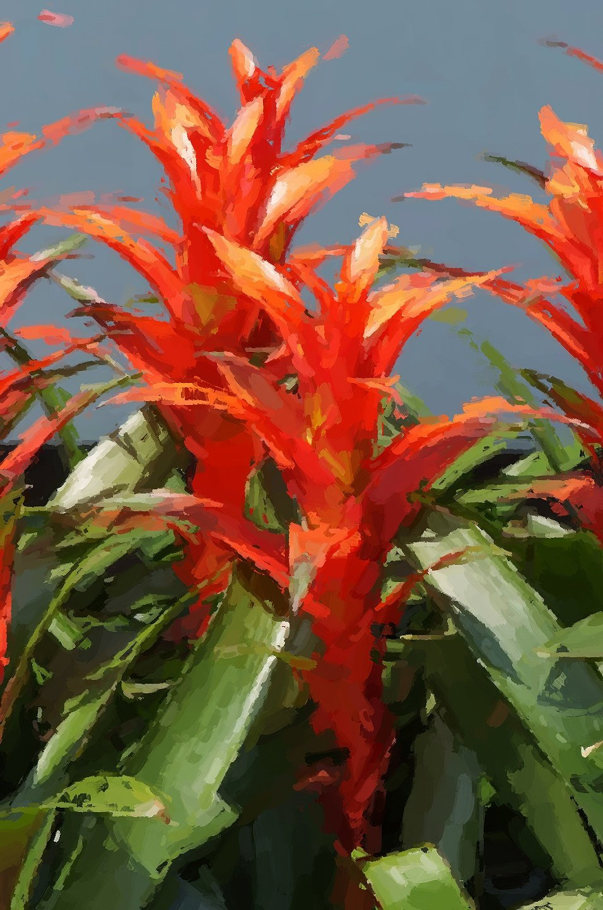

나의 질서를 조금씩 잃어가고 있구나 -

좀 더 늦게 잠들고 늦게 일어날 뿐이야

내가 정의한 평화가 이어지는게 아니라

날 긍정하는 이들만 주위에 남은 거야

 

- - -
 

멀고도 가까운 날이 오면, 싫어도 도착하겠지 어딘가에

그곳의 아침에도 눈을 떴을 때 깨어날 이유가 있기를

눈동자를 덮어주는 트로이메라이가 연주되기를

 

- - -
 

너에게 받은 것들, 끌어안기 버거운 것들

앞서 만났던 것들, 앞으로 만날 것들

프롤로그와 에필로그 전부를

진정 사랑할 수 있기를

바라며, 기도했어

 

- - -
 

 

