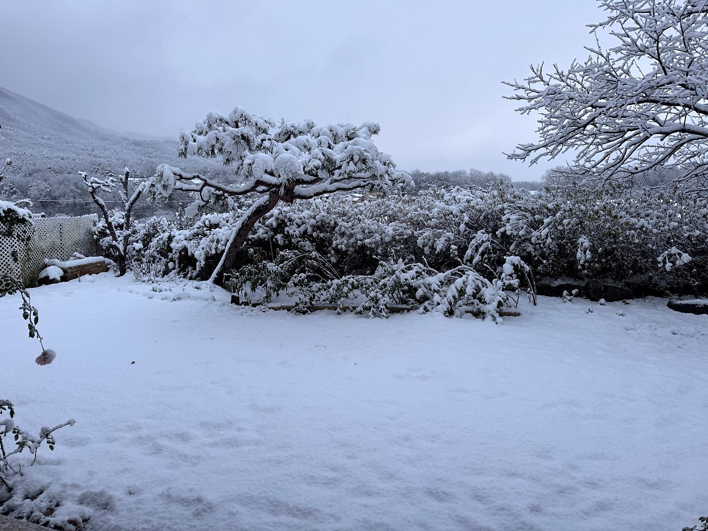

나무랄 것 없는 일상에 크리스마스 트리

나를 나무라는 듯한 환한 조명과 장식들

아아, 시늉 조차 않은 것도 죄란 말인가

 

- - -
 

머드러기들을 적재하고 남은 부스러기

패브릭 패턴에, 그야말로 배가 불렀어

이 근방도 금방 못쓰게 될 것 같아서..

 

- - -
 

몽상에 잠기거나, 골방의 사회 아나키즘

모름지기 인형극 뿐이라는 부화뇌동은 

유전자의 헤리티지 혹은 치명적 버그

 

- - -
 

 

