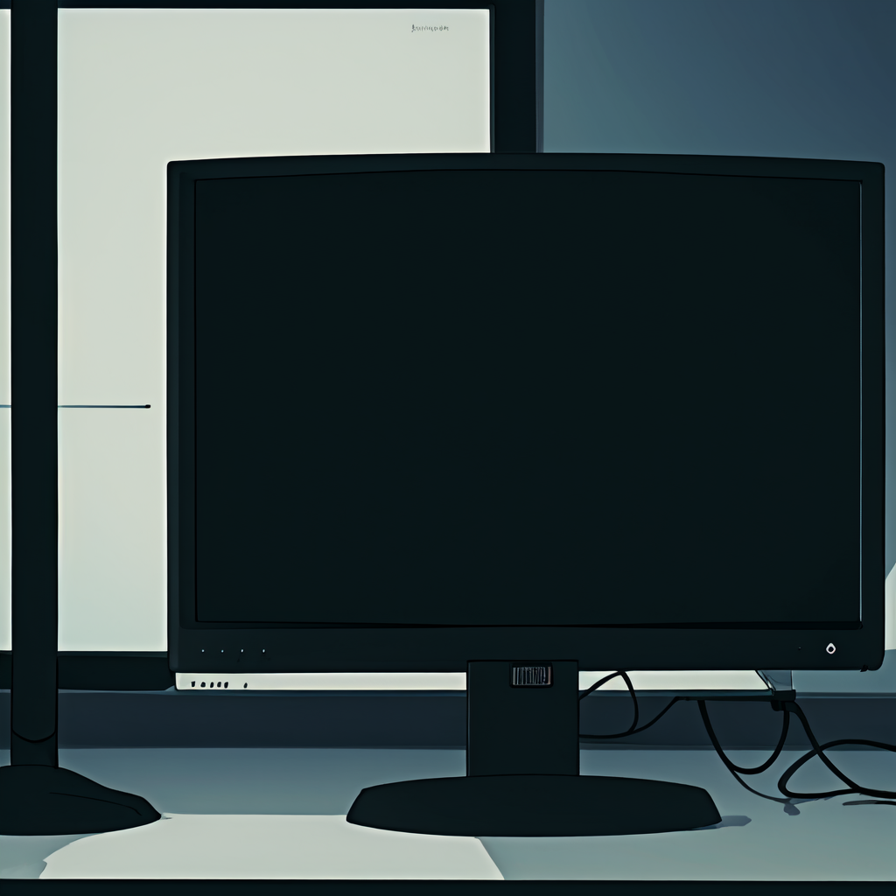

0과 1로 이루어진 조약돌을 던진다, 잔잔한 파동이 흩어진다

서서히 밑바닥에 잠긴다, 기적과 같이 떠오르지 않았다면

나는 오늘도 던진다, 어제도, 그리고 내일도 매일

손목과 팔꿈치, 어깨까지 저려오는 것은

덧없는 피조물의 사적제재인가

 

- - -
 

태양열에 끓어오르는 본능, 빛살 아래 무한히 펼쳐지는 망상

전조 없이 무너질 상아탑, 어떠한 계기로 끊어질 낚시줄

아무런 이질감 없이 너에게 노스탤지어를 덧씌운다

기이하지만 이건 만유인력과 같은 것이라서 

저항하려는 시도조차 해본 적이 없어

 

- - -
 

이윽고 우린, 광과학의 교집합에서 자아를 벗는다

망막과 달팽이관만이 존재하는 신인류로 퇴화-

사람이 잊혀질 때가 진정 죽는 것이라면

꺼진 모니터에 비치지 않는 형상은

내가 아니었으면 하는 바람

 

- - -
 

 

