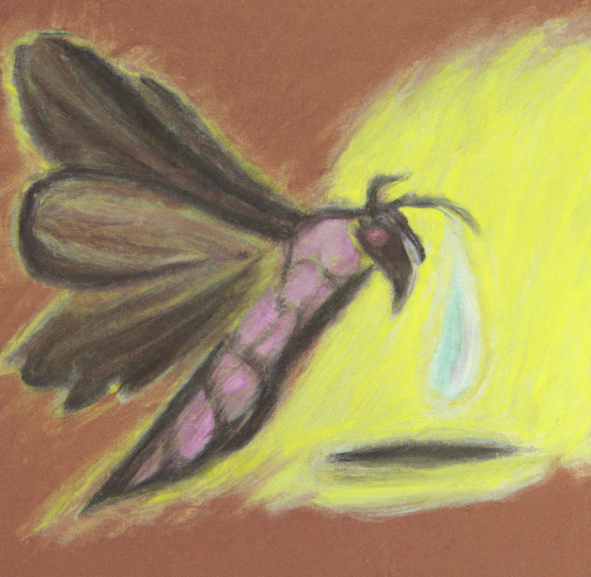

어느덧 1년, 지난 여름으로부터 스친 시간을 음미한다

뇌가 마르다 못해 타버릴 듯한 7월에 나는 울고 있었다

무사히 도망쳐서 숨을 쉬는, 단지 그 뿐인 일이었겠다만
 
 
 
야광별 아래 잠든 새의 눈물을 마시는 건 해갈이 아니었기에,

대가 없는 동경을 꿈 꾸던 소년의 목을 눌러 편하게 해주었다

 

그렇게 더러운 얼룩도 무늬가 되었다

그렇게 쓰디쓴 실패도 무늬가 되었다

그렇게 맘아픈 이별도 무늬가 되었다
 
 
 
그렇게 나를 거쳐 온 모든 흔적이,

나로 보이게 만드는 무늬가 되었다