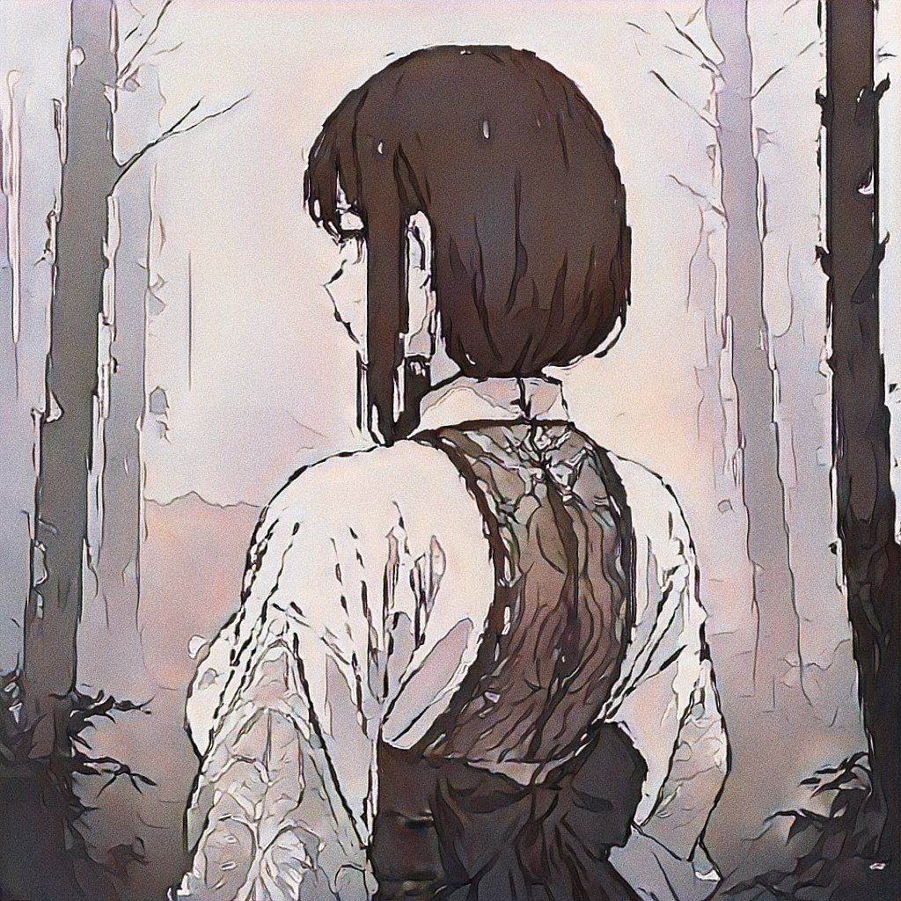

 

어른이 되어 읽은 동화는 슬프고도 위험한 안락(安樂)을 선사한다

새하얀 경험의 도화지에 여백이 넘쳤을 때, 최초로 번졌던 세피아

말하는 동물들과 마녀, 어두운 숲과 바다, 미숙하고 뒤틀린 선택

 

- - -
 

얼룩덜룩해진 종이를 들고 돌아가 만난 모르는 향기는  

왜인지 나의 삶을 전부 긍정해줄 것 같아서

늪에 서서히 빠지는 기분으로 

그저 따라가고 싶어져

눈을 감았다

 

- - -
 

이리 애틋한 마음을 가지는 것은 왜일까, 무언가의 상징일까

찾아가지 않으면 영영 기다리고 있을 뿐인 낡은 인형들

겨울잠에 취해 깨어나지 않는다면, 분명 죽을텐데

