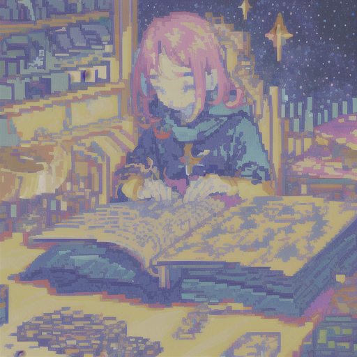

 

인류의 꿈과 언행- 의중을 이해할 수 없어 소설을 읽었어

가공된 인물들, 비교적 단순한 동기로 투명한 선형관계 서사

반대로 따분할 정도로 잘 짜여진 우주에 흥미거리라 한다면

인간 하나- 사람 둘 광활한 테라리움, 안의 작은 하바리움

너의 아주 단순한 작동원리의 표현조차 가늠할 수 없었어

그저 조화의 아름다움에 홀려, 넋을 잃고 바라보고 웃고

잔잔한 별무리 흐르는 빛에 세월 모르기를, 시나브로

관념의 껍데기가 녹아 흘러내려 사랑만을 읽었어

그리고 잃었어. 시뮬라크르 아닌 시뮬라시옹

행복의 잔상을 그리는 선과 면의 아늑함