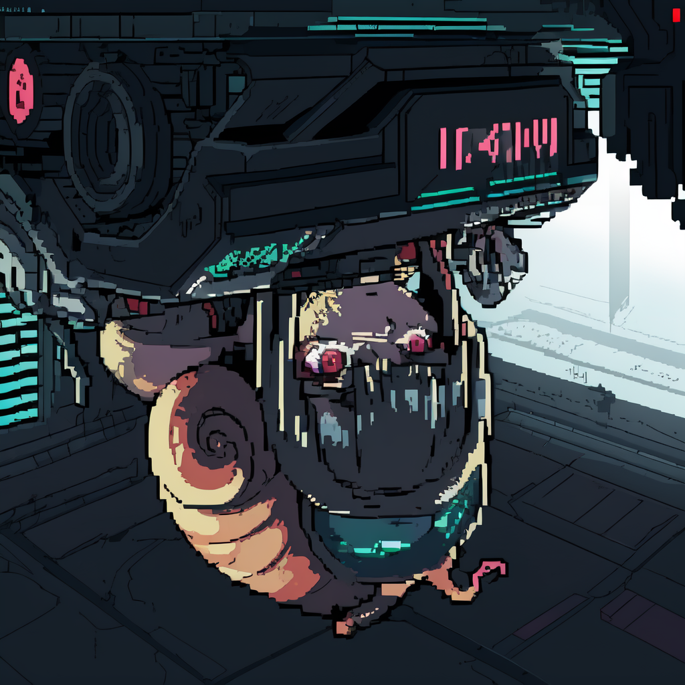

머릿속에서 음성이 울린다

이건 분명 내 목소리야

모르는 나의 목소리

나와 프시케의

하모니

 

downloading...
################################# 100.0%
clone_paradoxum.exe has been installed succesfully!

 

♡ × -∞

...

 

- - -
 

♡ × -271828182845904523536028747135…

카타르시스, 샤덴프로이데,

불안, 원망, 죄책감과 분노, 

슬픔, 그리움, 선망과 환멸,

사랑, 권태, 호기심과 집착,

혼돈, 욕망, 설렘과 두려움,

 

- - -
 

♡ × -99

꾸물꾸물

사지에 감각이 없어

마치 연체동물이 된 느낌이랄까

원래의 나에 대해 떠오르는 것도 거의 없어

얼굴이 있어야 할 자리에는 더듬이가 돋아난 기분이야

알 수 없는 두통에서 오는 강렬한 기시감

어제는 무슨 일이 있었더라?

의식이 몽롱해져가

빠지직!

 

- - -
 

♡ × -1

마음을 전한 사람이 있었다

떨리는 손으로 쓴 편지를 가슴에 품고

"한 눈에 반했어요. 받아주세요." 라고 하며,

아무래도 같은 마음이었던 모양이야

텅 빈 심장에 피가 돌았다

 

- - -
 

♡ × 0

확인 버튼을 누른다

｢귀하의 커넥톰 제공에 동의해주셔서 감사합니다. 감정을 재현할 수 있는 맞춤형 플레이어블 캐릭터 생성을 위해 루프 시뮬레이션을 시작하겠습니다. 곧 완전 몰입형 아바타가 완성될 예정이니, 잠시만 기다려주세요. - ANIMA Online｣

 

- - -
 

♡ × 1

요즘 유행한다는 게임이나 해볼까나

 

- - -
 

⇧

클론 파라독섬 이란 사용자의 기억이 완전히 희석될 때까지 통 속의 뇌 우측 해마에 의도적으로 노이즈를 가하며 리셋해, 최종적으로 감정의 블랙박스만 남은 빈 껍데기로 만들고 그 위에 자아를 덧씌우는 공법입니다.

모든 패턴을 계산할 수 없으며 응용력을 높이면 조합이 폭발적으로 늘어나 대응할 수 없기에 그동안 마인드 해킹은 불가능하다고 여겨졌지만, 아니마 온라인 개발팀은 다소 비인도적인 방식을 통해 모델 구현에 성공했습니다. 