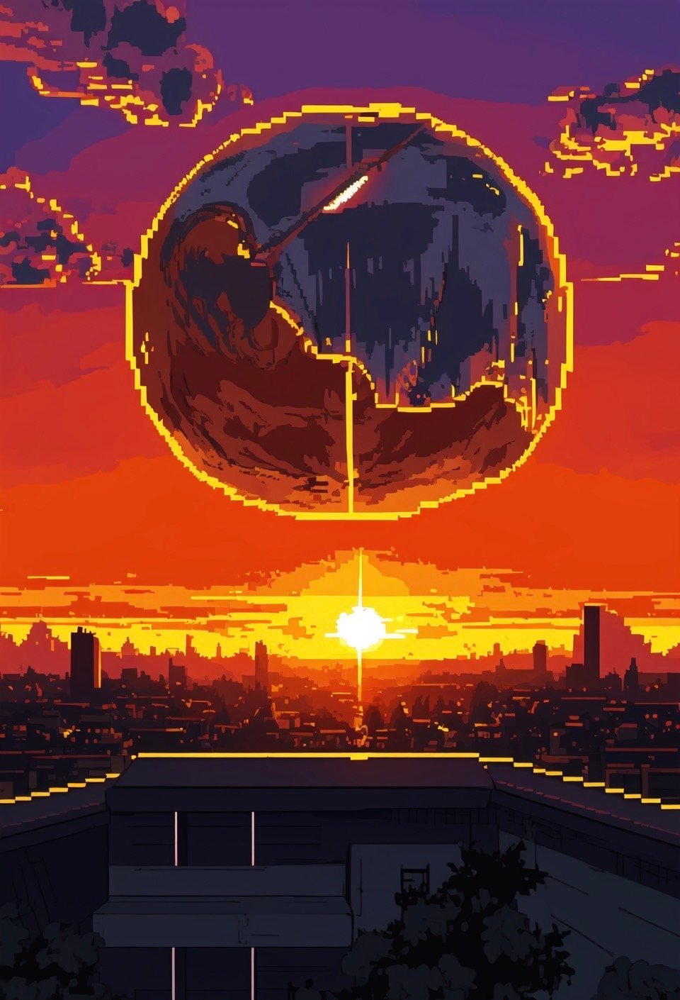

> "잊어도 좋을 것을 잊지 못하는 사람에게는 잊는 것이 병이라고 치자. 그렇다면 잊어서는 안 되는 것을 잊는 사람에게는 잊는 것이 병이 아니라고 말할 수 있다." - 유한준, 「忘解」

예기치 않은 불치병처럼, 죽음은 북을 두드리며 오지 않는다 
 

- - -
 

"그러니까 우리가, 무언가 잊어버린 기분이 들어서요."

그릉거리는 숨소리가 섞인 목소리에서 한기가 느껴진다

임종 직전의 환자는 종종 시간이나 장소, 사람을 구분하지 못한다

아마 그러한 증상의 연장선이라고 생각했다

"기억하던 것을 잊어버렸다는 말인가요?"

"…"

"잊어버린 듯한 느낌만 남아있는 걸까요?"

소년은 머뭇거리다 힘겹게 고개를 끄덕인다

흔히 있는 일이다

어째서 '우리'라고 말한 것인지는 모르겠지만,

마지막까지 생각나지 않은 것이라면 잊어도 좋을지 모른다

이런 때가 아니라면 언젠가 골로 간다는 사실도 잊은 채 살고 있으니

 

- - -
 

눈코 뜰 새 없었던 하루, 새벽녘 퇴근길 풍경은 잿빛이다

부모 없는 아이의 시신은 화장해도 봉안당으로 보내지 않는다고 한다

땅덩이도 좁으면서 연안에 유골을 뿌리는 것은 제한하지 않은 까닭이다

그래도 물에서 나와 물로 돌아가는 것이니 진정한 의미의 죽음이 아닐까

오늘 안락사한 그 녀석도 뼛가루가 되어 바다로 흩어지겠지

라고 생각하며 고개를 든 순간,

하늘을 뒤덮은 꿈틀거리는 어둠이 정체된 새들의 무리임을 깨달았다
 

- - -
 

꺼두었던 스마트폰을 켜자 온갖 알림이 밀려들어온다

실시간 뉴스는 운석이 곧 충돌한다는 헤드라인으로 도배 되어있다

'토리노 척도 Level 10 - 충돌 확실, 약 3시간 후 지구 멸망'

모르는 나라의 대통령이 흐느끼는 영상을 볼 때까지 실감이 나지 않았다

3시간. 종말을 막기에는 짧지만 마음의 준비를 하기에는 의외로 긴 시간

소중한 이들에게 작별 인사를 할까, SNS로 사람 구경하는 것도 좋다

더 흘릴 눈물도 없는 이들은 구원을 부르짖으며 노아의 방주를 찾고,

사랑했던 모든 것들을 어루만지며 조용히 잠에 드는 이들도 있겠지

오만한 나는 누워서 손바닥 안의 우주를 들여다보며 시간을 죽였다
 

- - -
 

다시는 지지 않을 해가 뜨고

바닥이, 몸이 진동하기 시작한다

푸른 별은 미립자가 되어 우주로 흩어지겠지

_사실은 나, 아직 죽고싶지 않아. 오늘이 마지막일거라고는 전혀 생각하지 않았어. 아무일 없는 평범한 하루였잖아. 이대로 전부 사라질 거라면 인류는 왜 시작한건데. 공룡들도 이런 기분이었을까. 이건 현실이 아니야. 현실이 아니야. 현실이 아니야. 아아 바로 앞까지 오고있어_

우리가 무엇을 잊고 있었는지 이제는 알 것만 같다

 

