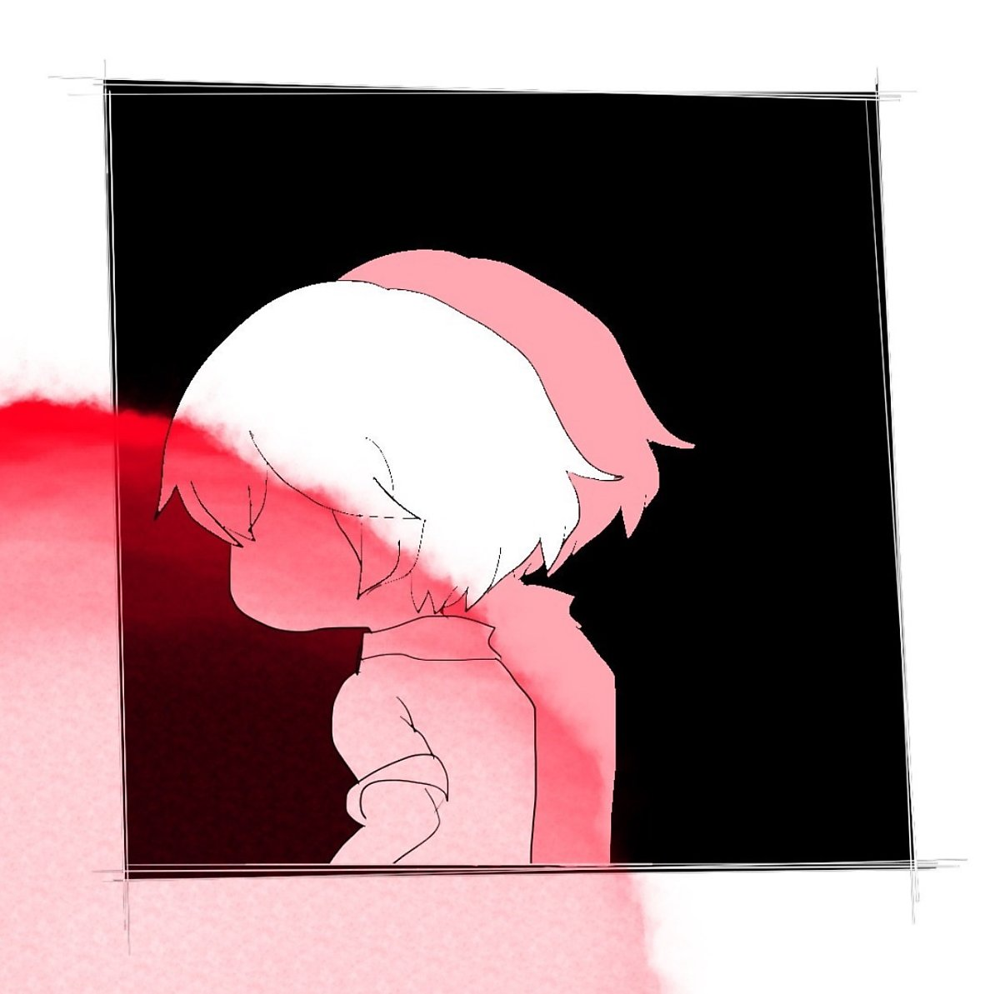

이름을 아는지는 그닥 중요하지 않으니,

정교한 플롯으로 움직이는 몇 분 남짓한 단편극

마지막 찰나의 반전을 꿈꾸는 아마추어 배우이자 관객

이상 자기소개입니다.

> TDZ(Temporal Dead Zone): 변수의 선언 전 참조를 막기 위한 규칙이다.

한 손에 압생트 잔을 들고 북유럽 가구점에서 구매한 소파에 몸을 맡긴다

몬드리안의 추상화처럼 짜여진 대본을 읽으며, 입술 사이 독을 흘러넣는다

차기작에서 맡은 배역은 아름다움의 극치를 좇아 상아를 깎는 불굴의 조각가

공교롭게도 나와 처지가 비슷해 보여, 시나리오를 받은 순간 마음을 빼앗겼다

> 코드는 미리 작성된 선형적 인과관계를 따르는데, 선언문은 런타임 이전에 스코프 최상단으로 끌어올려지는 듯한 현상(Hoisting)이 발생한다.

연기를 하지 않을 때의 나는 마치 유령이 된 것만 같은 기분을 지울 수가 없어

장면은 머릿속에서, 연필로 그려낸 듯한 선으로 수십 수백 번 시뮬레이션된다

실로 아름다운 것을 목도한 순간 바뀐 뇌 구조는 내게 무한한 연산을 요구했다

언젠가부터 스크린 속 내가, 날 보며 웃는 듯한 착각에 강렬한 위화감을 느낀다

> 따라서, 의도치 않은 동작을 방지하기 위해 변수를 선언 전까지 잠시 죽은 상태로 취급한다.

클리셰를 1도 따르지 않는 미장센, 그렇기에 졸음이 쏟아지는 싸구려 국산 영화

어쩌면 시네마 밖의 내가 아닌 저 안의 내가 진짜 아닐까, 라는 생각이 들 때 즈음

아아- 환각이 아니다. 헛되지만 공(空)하지 않고 없지만 0이 아닌 드라마 속 망령이

레터박스 너머로 몸을 반쯤 내밀고, 여신을 빚어내던 두 손을 뻗어 내 목을 조른다

> 참조하면 'ReferenceError'가 아닌 'undefined'가 출력된다는 점에서 알 수 있듯이, 컨텍스트는 일시적 사각지대 안에서 분명 실존하지 않는 변수의 존재를 인식하고 있다.

한 손에 압생트 잔을 들고 북유럽 가구점에서 구매한 소파에 몸을 맡긴다

차기작에서 맡은 배역은 월광의 아름다움에 취해 가족을 버린 광기의 화가

..라고는 하지만, 지금의 나 또한 연기를 하고 있다는 기분을 지울 수가 없어

여러분, 당신은 어떤가요. 스스로에게 만족할 만한 예술을 선보이고 있나요?

 

