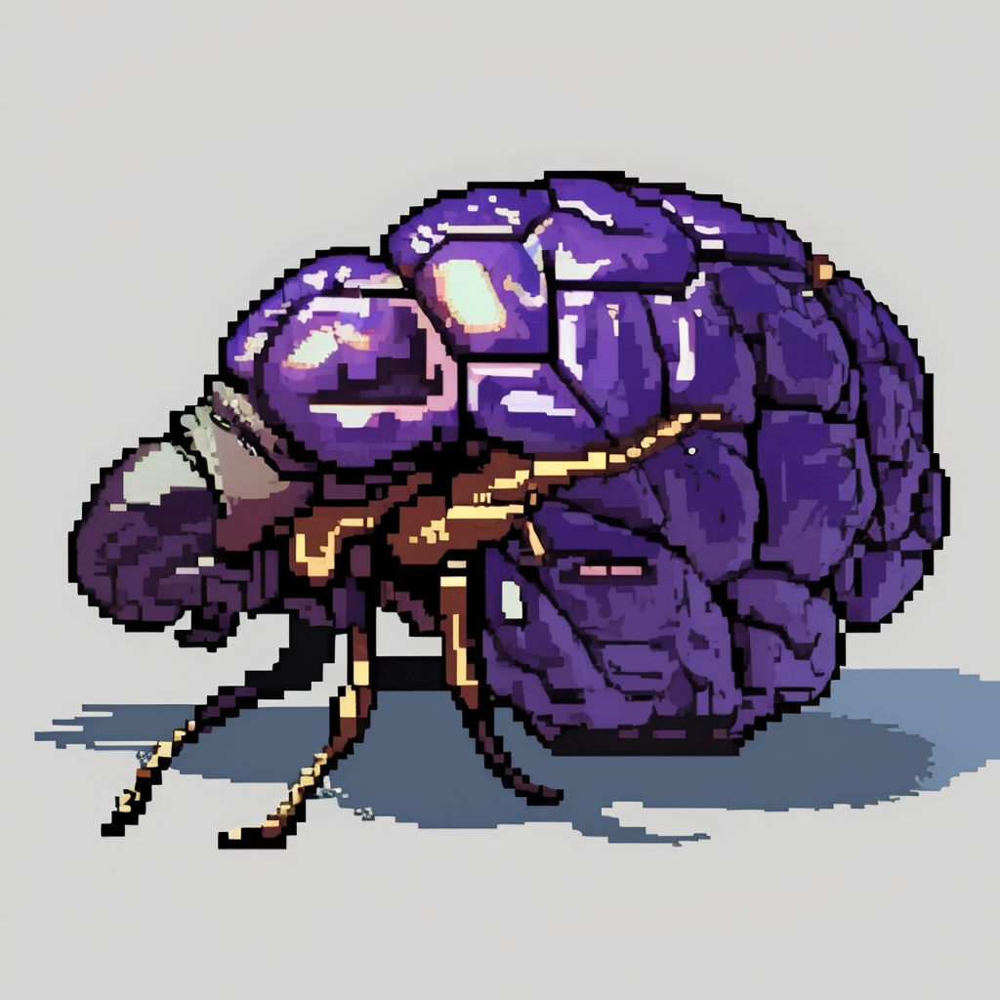

분명 나의 뇌 속에 기억을 먹는 유충이 기어다닌다. 작은 톱날과도 같은 입을 연신 움직여 육질이 부드러운 곳부터 파먹어 내려간다. 그럴싸한 추억과 같은 것이, 겉으로 보기엔 멀쩡해 보이지만 속은 텅 비어있다. 어느새 나의 머릿속엔 인터넷에 검색하면 나올 딱딱한 지식 정도만 남게 될 것이다.

눈은 희미한 윤곽을 담고, 귀에 로파이 음악을 흘러넣으며 꿈결에 자전거를 탄다. 흔들리는 시야, 몸이 우측으로 쏠린 순간 뒤에 큰 경적이 울리며 트럭이 스쳐 지나간다. 위험했다. 라는 생각이 들면서도 심장은 놀라울 정도로 차분하다. 마치 꿈 속의 일처럼 느껴졌다. 정말 꿈 속의 일이었는지도 모른다.

마지막으로 꿈을 꾼 것이 언제인지 기억이 나지 않는다. 정확히는 꿈을 꾸어도, 내용이 순식간에 휘발되고, 꿈을 꾸었다는 사실 자체에 의심이 가는 것이다. 어느 순간부터는 현실의 일마저 비슷한 현상이 일어났다. 가령 오늘 먹었던 점심이 무엇인지 기억해낼 수가 없었고, 점심을 먹었는지조차 의심이 갔다.

이는 점점 심해져, 오늘은 온 몸의 감각이 공중에 둥둥 떠다니는 느낌으로 하루를 보내고 있다. 나는 이대로 깨어나지 않는 꿈을 꾸는 기분으로 사는 것도 나쁘지 않겠다는 생각이 들었다. 그도 그럴 것이, 무언가 기다리는 일 없이 시간의 흐름을 체감하는 삶은 나에겐 참을 수 없는 가벼움이었기 때문이다.

언젠가 나에게도 눈썹을 찡그리지 않고 하늘을 바라볼 수 있던 시절이 있었다. 이윽고 유충은 자라나 성체가 되어 새로운 누군가의 뇌에 알을 까러 날아간다. 기억을 슥 훑고, 아득하게 아련한 추억만을 먹고 자라나 머리 위에 한 바퀴 원을 그리고 훨훨 날아간다. 그동안 아마도 꿈을 꾸었다. 슬픈 단잠이었다.
 

- - -
 

 

