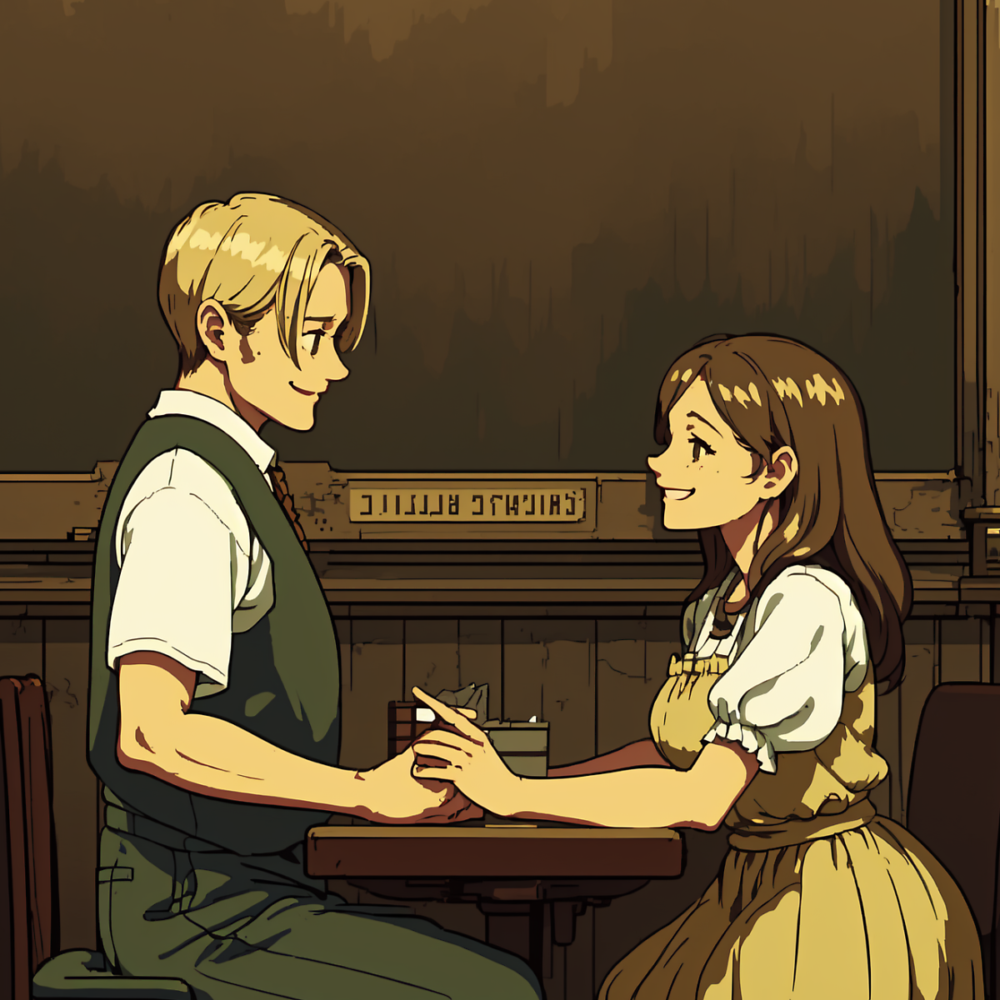

 

 

- - -
 

 오늘도 보낸 사람이 없는 편지가 도착했다 

 

 내일을 살아갈 이유, 그에게서 선물이 왔다 

 

 발신인은 적혀있다. 단지 그녀가 세상에 없을 뿐이다 

 

 처음에 이런 건 저주라고 생각했지만 이제는 아니야 

 

 재잘 재잘 떠드는 그 눈빛 끝에 내가 비칠 일은 없겠지만 

 

 가끔 짖궂은 말을 하는 당신을 손가락으로 찌를 수는 없지만 

 

 황금빛 낮잠에 취해, 존재하지 않는 주소로 답장을 써 보낸다 

 

 조그만 편지지 한 장을 꺼내, 신중하게 한 단어씩 써 내려간다 

 

 하루 한 번만 허락된 이유는, 깨어나지 못할 수도 있기 때문일까 

 

 꿈의 뒷이야기를 좇아, 여기로 찾아간다면 영영 사라질 것 같아 

 

- - -
 

 

