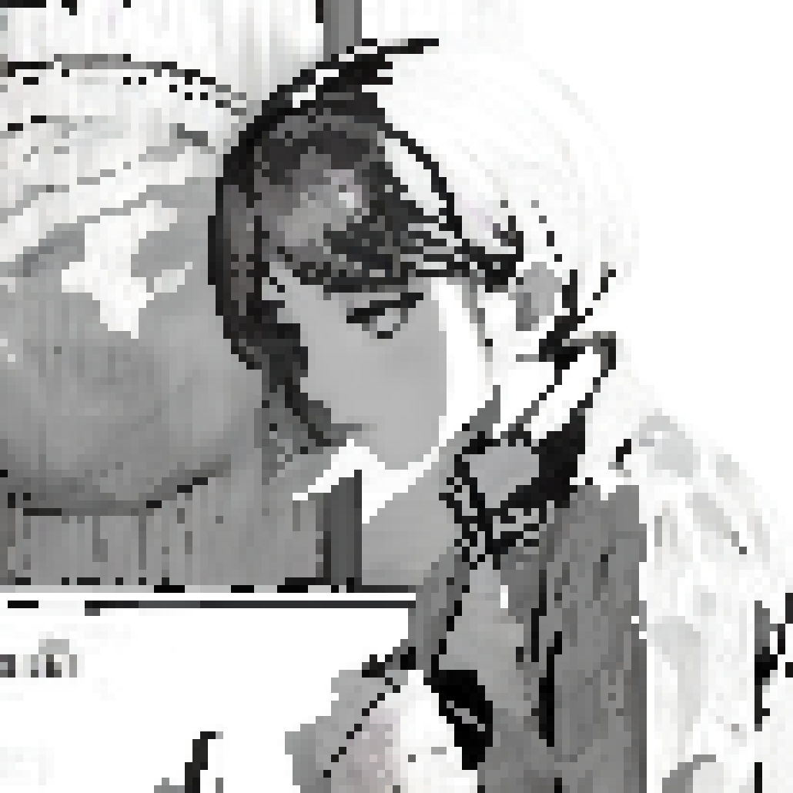

나는 묶여 있다. 내 앞에 앉아있는 남자는 나를 무척 닮아 있다. 유대인들이 쓸 법한 ㄷ자 모양 테이블 한가운데에 자리한 그는 본인의 이름을 아서라고 소개했다. 「아직 의식이 몽롱하신 것 같군요.」 라고 말하며 미소 짓는 그의 눈은 전혀 웃고 있지 않다.

창 밖은 어둡고, 빗소리가 들린다. 「보다시피 밖으로 나가는 건 추천 드리지 않습니다.」 그가 자리에서 일어나 구석의 코너를 돌아서 내게 다가온다. 「저는 거짓말을 하지 않을 테니, 당신도 하지 말아주세요.」 라고 말하며 작은 나무 의자에 고정된 내 앞에 마주 선다.

원하는 것이 무엇인지 물었다. 「당신이 청렴결백하기를 바랍니다. 이건 심판이니, 너무한 처사라고 생각하지 말아주세요.」 그의 입에서 가장 우려했던 종류의 말이 나왔다. 무슨 정의의 사도라는 되는 것인가. 「저는 거리를 깨끗하게 유지할 의무가 있습니다.」 그는 덧붙였다.

나는 나쁘지 않아. 누구에게도 피해를 주지도, 받지도 않으려 애쓰며 살아왔어. 내게 고해성사라도 하라는 거야? 내 생각을 읽기라도 한 듯이 그는 고개를 젓는다. 「이해할 수 없다는 표정을 짓고 계시네요. 제가 이야기하는 건 어린 애 앞에서 인형탈을 벗는 일 따위가 아닙니다.」

스치듯 내 뒤로 걸어가는 그의 허리춤에서 순간 번쩍인 십자가 모양의 스틸레토를 나는 보았고, 그가 다시 입을 떼기를 잠자코 기다렸다. 「한 가지 물어보겠습니다. 만약 절대 들키지 않는다면 도박장에서 속임수를 쓰는 건 당연한 걸까요?」 나는 고개를 저었다.

「솔직하게 말씀해 주셔도 됩니다. 성실한 사람은 공허해지는 법이니까요.」 어떻게 그의 심기를 거스르지 않는 답변을 할 수 있을지 머리를 굴리는 사이, 그는 말을 이었다. 「그녀가 모른다면 죄가 아니라고 생각하셨나요?」 아무래도 내 의견은 중요하지 않았던 모양이다.
 

- - -
 

_내가 세상을 보는 방식은, 나무보다 숲을 보는 편이라_

너는 갑작스럽게 다시 나타났다. 공교롭게도 새로운 사람을 만났던 시기에, 단지 심심했을 뿐이라지만 연락이 닿았다. 내 이상형은 너를 많이 닮아 있지만, 너는 나에게 솔직했고 나는 그러지 못했기에 가까워질 수록 도망가는 나쁜 버릇이 있었다.

_너가 보여준 모습은, 서툴지만 밝고 투명해서_

내가 찾는 행복의 시나리오는 여기 없겠지만, 이제는 선을 넘어서 너의 문제를 해결해 줄 수도 없지만, 그저 너의 목소리를 듣고 시덥잖은 얘기나 나누는 달콤쌉싸름한 시간 낭비를 또 할 수 있지 않을까 생각했다. 나만, 우리만 괜찮으면 상관없는 거 아닐까.
 

- - -
 

어느새 나를 묶었던 밧줄은 풀려 있고, 내 손에 스틸레토가 쥐어져 있다. 「울고 있네요. 저는 당신을 이해할 수 없습니다.」 라고 말하는 그의 눈동자 끝에도 슬픔이 비친다. 내가 유일하게 속인 사람은 나 자신이었다. 나는 나를 죽일 수도 없는 괴물이었던가.

동이 트고, 빗소리가 그쳤다. 누군가 혼자 밖으로 나왔다.
 

- - -
 

 

> 정의를 이해하려는 그대들이여. 모든 행동을 환한 빛에서 살펴보지 않는다면 어찌 정의를 이해할 수 있겠습니까. 그런 후에야 그대들은 깨달을 것입니다. 똑바로 일어선 의인과 타락한 죄인은 그저 한 사람이 난쟁이 자아의 밤과 거룩한 자아의 낮 사이, 어스름한 빛 속에서 서 있는 것과 같음을. - 칼릴 지브란, 「예언자」