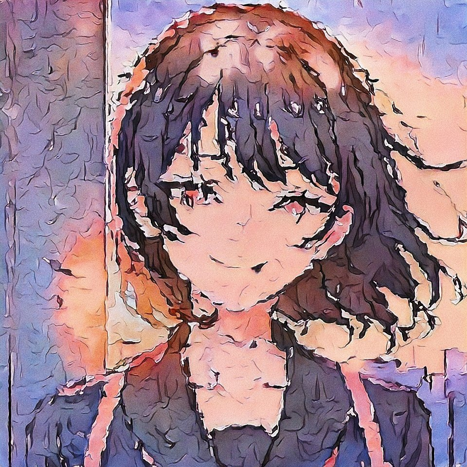

다 건너지 못할 신호등에 발을 들이고, 작은 생명을 밟아 죽인다.
 
 
 
너는 항상 그랬다. 사소한 행동 하나하나가 나의 주의를 끌었다.
 
 
 
강요하는 듯한 부조리가 정오의 태양처럼 사지에 들러붙는다.
 
 
 

_며칠 전부터 빤히 쳐다보는 녀석이 있어_

 
 
 
문학 교과서에 나오는 계절의 고양감은 이성을 집어삼켜버렸다.
 
 
 
너가 자주 올라가는 옥상에 명확한 이유 없이 따라 들어간다.
 
 
 
구름 한점 없는 공허 아래 두 쌍의 눈빛, 초점이 겹쳐진다.
 
 
 

_왜 그렇게 무서운 눈으로 보는 거야?_

 
 
 

 

 
 
 
머리 위로 찍어내리는 그로테스크한 햇볕에 정신은 몽롱해진다.
 
 
 
마치 열병 같은 것이 아닐까. 타는 듯한 대기 속에서 일렁인다.
 
 
 
구원인지 저주인지 모를 짙은 동공, 망각의 호수로 뛰어든다.
 
 
 

_너를 녹여버리고 다시 만들어봐도 될까_

 
 
 
악에서 피어난 꽃다발이라도 마음을 빼앗긴다면 선이라 여겼다.
 
 
 
방과 후 교실을 메우는 분홍빛 향기, 형광색 웅덩이가 고인다.
 
 
 
어째서 나, 날붙이를 휘두르고 있는거야. 자아는 희미해진다.
 
 
 

_맛을 본 이상 그릇까지 핥는 짐승으로_