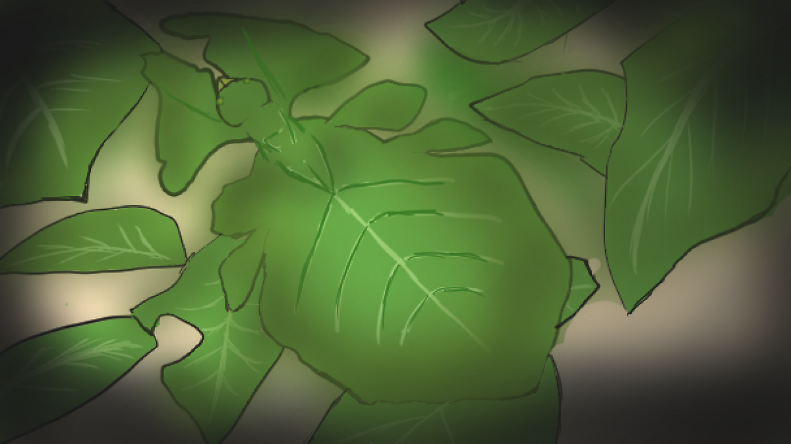

 

말레이시아 서부 숲 속 나무
가지에 나뭇잎 벌레 한 마리가 붙어있다.

나뭇잎 벌레의 삶은 정말 단순하다.
마치 나무의 일부인 것처럼 가지에 붙어있다가
배고파지면 체리, 라즈베리, 망고 등 맛있는 과일을 먹는다.
포식자들은 나뭇잎과 똑같이 생긴 벌레를 발견하지 못하고 지나친다.

광합성 하는 나뭇잎들 사이에서 몸을 흔들 때면
벌레는 마치 나무가 된 것 같았고
숲 속의 먹이사슬은 우습게만 보였다.

시간이 지나
나무에서 나뭇잎이 하나 둘 떨어질 때가 오면
벌레는 애써 외면하고 있었던 진실을 마주한다.

자신의 유일한 재주가 그저 '나뭇잎인 척하는 것'이고
이는 오래 가지 못한다는 것을

나무에서 떨어진 벌레는 
땅 위에서 너무나 이질적인 존재였다. 

평균 수명 6개월
나뭇잎 벌레의 삶은 정말 단순하다.