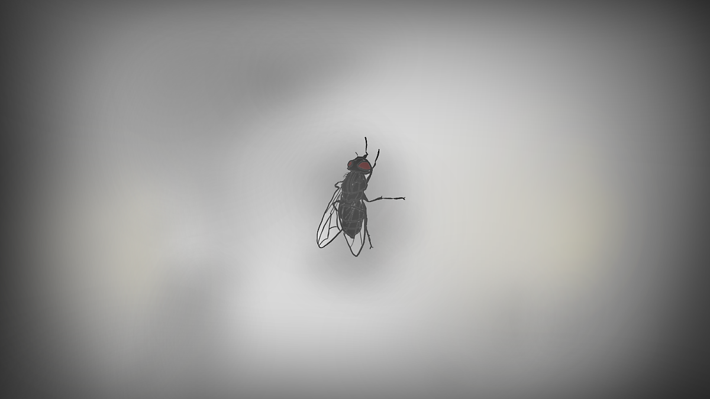
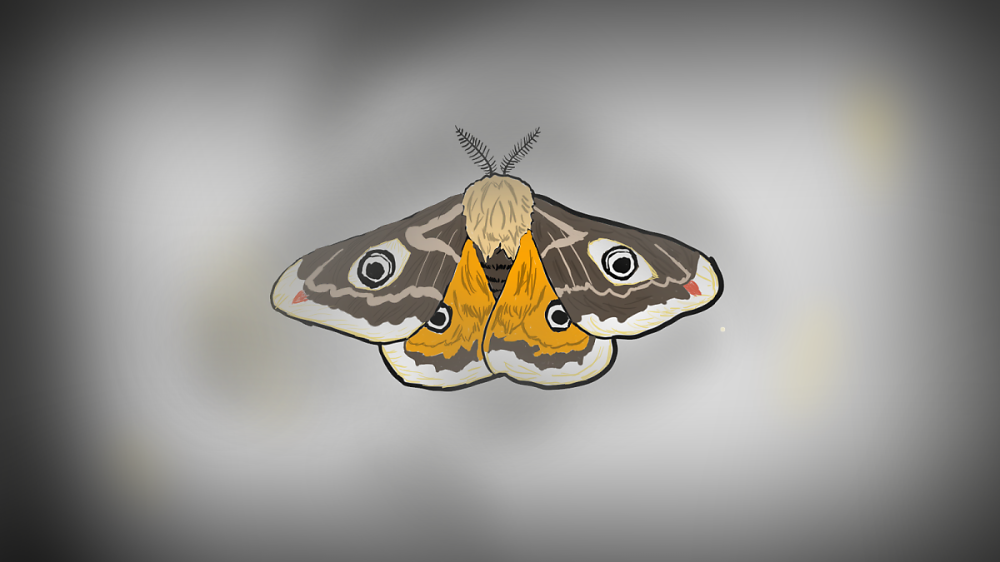
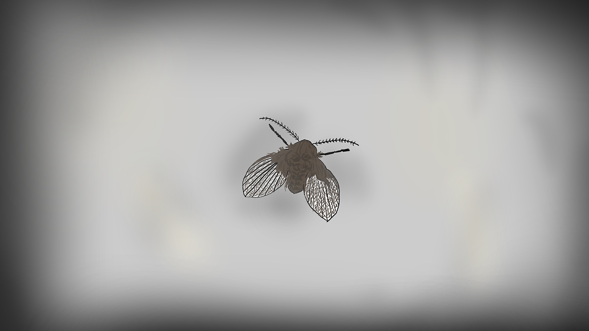

내가 반지하에서 자취하던 시절

방에 벌레들이 종종 나오곤 했다.
 
 
 
파리, 나방, 그리고 나방파리 등등
 
 
 
가만히 누워 벌레들을 관찰하고 있으면

고민들을 잊고 잡생각에 빠지기 좋았다.

 

가장 흔하게 보이는 파리들은

가장 벌레다운 면모를 보여준다.
 
 
 
본능에 충실해

음식이 남은 곳에 귀신같이 몰려들고

유리창에 몇 번이고 머리를 박는 모습은
 
 
 
순수한 것인지 멍청한 것인지

킥킥..

 

가끔 나타나는

이 알 수 없는 녀석은
 
 
 
대체 어디로 들어온 건지

크기부터 남다르다.
 
 
 
날개의 기괴한 무늬를 보고 있으면

알 수 없는 위압감 마저 느껴지는데
 
 
 
아마 벌레들 사이에서도 난 놈일 터이지

 

요즘 들어 슬슬 보이는

나방도 아니고 파리도 아닌 이 애매한 것들은
 
 
 
아무것도 하지 않는다.
 
 
 
미동도 하지 않는 녀석들을

손가락으로 살포시 누르면

그대로 그냥 죽어버리는 것이다.
 
 
 
…
 
 
 
나방을 경외하고 파리를 멸시하지만

아마 나방도 파리도 될 수 없었겠지
 
 
 
아마

가만히 누워있는 나처럼

생각만 많은 것이겠지