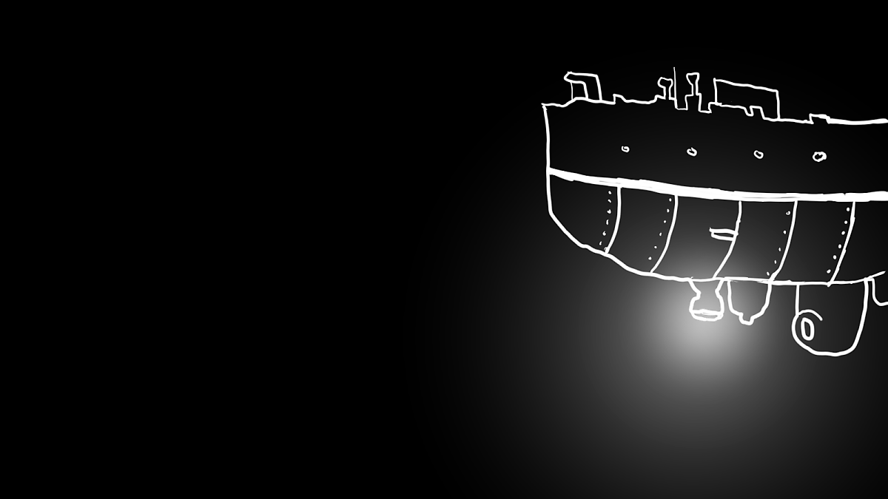
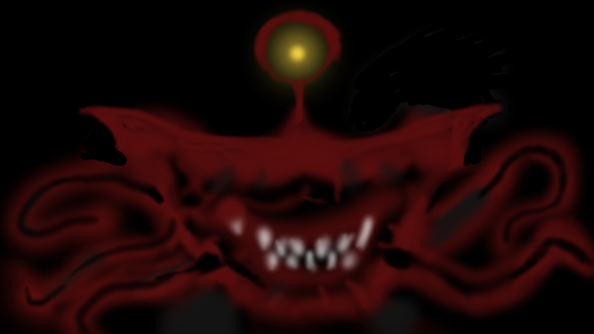

 

해양 기술의 발전으로 안전한 심해 탐사가 가능해지고, 급기야 어린이를 대상으로 '잠수함 심해 체험학습'까지 생겨났다.

그리고 그 날은 새싹 유치원의 심해 체험학습 날이었다.

"자~ 여러분 모두 준비되셨나요?" "네!!" 노란 모자를 쓴 아이들이 기대감과 설렘 가득한 표정으로 모여 앉아있다.

"좋아요, 그럼 출발해볼까요?"

- - -

_덜컹 덜컹_

교사의 말이 끝나자 잠수함이 점점 밑으로 내려가기 시작했다.

"앗, 저기 정어리 떼에요!" 교사가 창 밖을 가리켰다. 밖에는 얼핏 봐도 수천마리는 되어 보이는 정어리들이 거대한 덩어리를 이루며 지나갔다. "엄청 많아~" "신기해!" 아이들이 북적인다.

"얕은 바다에 사는 물고기들은 저렇게 친구가 많답니다. 마치 여러분 같지 않나요?" 교사는 웃으며 레버를 아래로 당겼다.

- - -

_덜컹 덜컹_

잠수함은 점점 빠른 속도로 내려갔다.

"아, 저기 덤보문어에요. 귀엽게 생겼죠?" 아기 코끼리처럼 생긴 알록달록한 문어 몇 마리가 지나갔다. "와!" "귀여워~ 풍선 같아" 아이들이 재잘거린다.

"열악한 환경에 적응한 생물들은 개체수는 적지만 훨씬 다양한 종류가 있답니다.. 탐사 로봇이 깊이 잠수하면 한 시간에 열다섯 종류가 넘는 새로운 물고기를 발견할 정도에요"

- - -

_덜컹 덜컹_

시간이 지날수록
깊이 내려갈수록

점점 어두워지는 배경 탓이었을까, 실내에 약간 서늘한 분위기가 감돌았다.

"마귀상어네요. 조금 무섭게 생겼죠?" 창 밖에 코가 길고 이빨이 기괴하게 돋은 상어 한 마리가 지나갔다. "와.. 멋있긴 한데.." "저런 건 처음 봐" 아이들이 웅성거린다. 

"어? 저건 뭐지?" 정신 없이 구경하는 아이들 사이에서 한 아이가 반대쪽 창문을 손가락으로 가리켰고, 그 곳엔 노란 빛 같은 게 아른거리고 있었다.

교사는 잠시 침묵하더니 마른 침을 꿀꺽 삼켰다. "운이 좋군요. 아직 발견되지 않은 종인 것 같습니다"

서서히 다가와 모습을 드러낸 그 생물은, 노랗고 커다란 눈이 하나 더듬이처럼 달려 있었고 가오리 같은 몸통에 문어 다리 같은 촉수들을 꼬리처럼 늘어뜨리고 있었다.

 

어둠 속 형형한 그 눈빛과 아이들의 눈빛이 마주한 그 순간

공포감

그것은 미지(未知)에서 오는 가장 원초적인 공포인 동시에
당시엔 뭐라 설명하긴 어려웠지만, 마치..

마치 인생의 결말을 본 느낌이었다.

"으아아앙!" 아이들은 울음을 터뜨리거나 기절했고, 당황한 교사는 황급히 레버를 끌어 올렸다.

- - -

그 심해어는 학계에 보고되긴 커녕 이후 단 한 번도 발견되지 않았고, 나는 그것이 참 다행이라고 생각했다. 

어른이 된 지금 다시 돌이켜 보면, 심해의 깊이와 내 시간은 그리 다르지 않았던 것 같은데

그럼 어둠 속 형형했던 그 눈빛도 내 눈빛이 아니었을까?