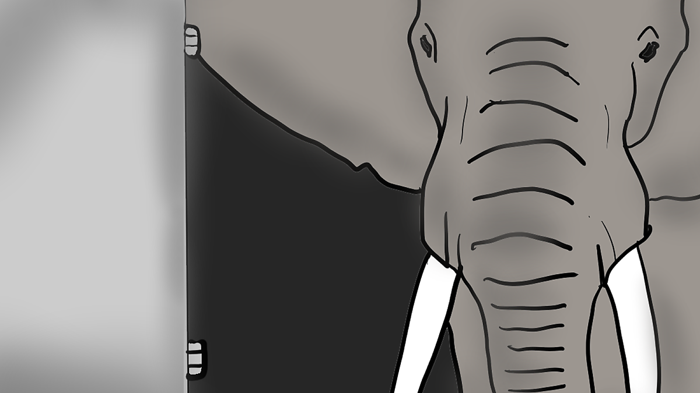

_따르르릉!_

_탁_

5분 후 다시 알림.

어제도 유행 지난 게임을 하다가 잠이 든 창식이는
올해 27살, 원룸에서 자취하고 있다.

고인물 썩은물 소리를 들으며 남은 유저들을 괴롭히는 게
요즘 창식이의 유일한 삶의 낙이다.

_따르르릉!_

_탁_

"으.."
더는 미룰 수 없어 매트리스에서 일어난다.

얼마 전 오른쪽 어금니에 충치가 생긴 창식이는
아침밥 시리얼을 왼쪽으로만 씹고 있다.

왼쪽으로만 씹으면 아프진 않으니
귀찮게 치과에 갈 생각은 들지 않는다.

_삑_

카드를 꼽고 공장에 출근
조립하거나 뭘 나르거나.. 그런 일들을 한다.

"창식이 형!"
아는 동생이 말을 붙인다.

"공장에서 꽤 오래 본 거 같은데, 형도 이제 어디 자리 잡을 때 아냐? 하하"
"뭐.. 그렇지"

창식이도 안다.
그저
엄두가 나지 않을 뿐이다.

_땡땡땡!_

끝을 알리는 종이 울리고
녹초가 되어 터벅터벅 돌아오면
다시 원룸에서 편히 쉴 수 있다.

그랬어야 했다.

_끼-익_

문을 열자 원룸 안에 
웬 코끼리 한 마리가 있다.

 

"어떻게.. 이런.."
창식이가 처음에 느낀 감정은 당혹스러움.

'헛것인가?'
'신고해야 하나?'
'아니, 애초에 어떻게 들어간 거지?'

있을 수 없는 일이지만
원룸 안에 있는 것은 틀림 없이 살아있는 코끼리였고
그 거대한 몸집으로 방의 절반 이상을 차지하고 있었다. 

"이런 미친.."
그 다음엔 분노.

거대한 코끼리는 이에 답하듯
눈을 끔뻑거리거나 코를 조금 흔들 뿐
창식이에게 별 관심이 없어 보인다.

…

마지막은, 체념.

창식이는 코끼리 다리 사이로 비집고 들어가
매트리스 구석에 새우처럼 웅크려 조용히 눕는다.

솔직히 처리할 기운도 없고 
엄두도 나지 않는다.

그날 밤
창식이가 잠을 이루지 못한 건
아마 오른쪽 어금니의 충치 때문이었을 것이다.